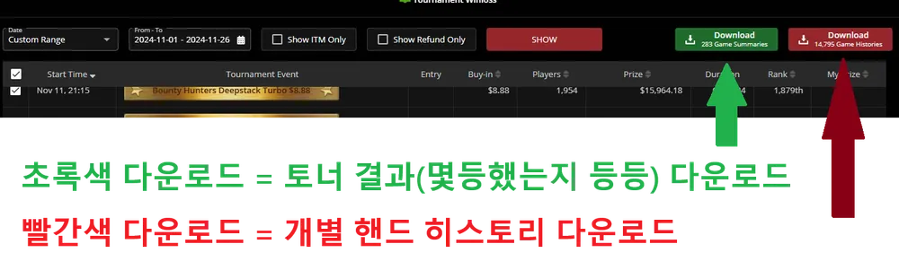

# Pokercraft Local 사용 가이드 (한국어)

*This document is a user guide for Korean non-programmers.*

이 문서는 Pokercraft Local을 사용하는 가이드를 담고 있습니다.
이 문서의 타겟 독자층은 프로그래밍을 잘 모르는 한국인입니다.
일반적인 개발자를 위한 문서는 [README.md](README.md)를 참조해주세요.

## 웹 앱 사용하기 (권장)

**[Pokercraft Local 웹 앱 바로가기](https://pokercraft.mcdic.net)**

설치가 필요 없으며, 브라우저에서 바로 실행됩니다. 데이터는 여러분의 기기에서만 처리되며 어디에도 업로드되지 않습니다.

Pokercraft Local을 활용해서 나온 분석파일들의 데모는 다음 링크들을 통해 보실 수 있습니다.
(제꺼 데이터로 만든 분석파일들입니다.)

- [토너먼트 결과 분석 데모](https://blog.mcdic.net/assets/raw_html/damavaco_performance_kr.html)
- [핸드 히스토리 분석 데모](https://blog.mcdic.net/assets/raw_html/damavaco_handhistories_kr.html)

## 데이터 준비하기

Pokercraft Local에 쓰일 수 있는 데이터는 2가지입니다.
*Pokercraft - My Tournaments* 섹션에 들어가면 다음 2가지 종류의 데이터를 다운받으실 수 있습니다.

- 토너 결과(Game Summaries): 위 사진의 초록색 다운로드 버튼을 누르면 받는 데이터로, 토너먼트 결과 분석에 쓰일 데이터입니다. 웹사이트 상 데이터의 유효기간은 12개월입니다.
- 핸드 히스토리(Game Histories): 위 사진의 빨간색 다운로드 버튼을 누르면 받는 데이터로, 핸드 히스토리 분석에 쓰일 데이터입니다. 웹사이트 상 데이터의 유효기간은 3개월입니다.

핸드 히스토리 같은 데이터는 주기적으로 컴퓨터에 다운받아서 쌓아두시는 것을 추천합니다.
데이터 `.zip` 파일을 받으시면, 압축해제 하지 마시고 그냥 `.zip` 상태로 놔두세요.

---

감사합니다.
