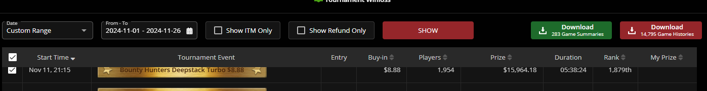
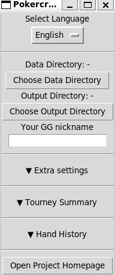

# Pokercraft Local

This is a customized visualization tool using downloaded data from Pokercraft in GGNetwork.

## Try it Online (Recommended)

**[Launch Pokercraft Local Web App](https://pokercraft.mcdic.net)**

No installation required - runs entirely in your browser using WebAssembly. Your data stays on your device and is never uploaded anywhere.

## Demo

- [Tourney result analysis](https://blog.mcdic.net/assets/raw_html/damavaco_performance_en.html)
- [Hand history analysis](https://blog.mcdic.net/assets/raw_html/damavaco_handhistories_en.html)

## Features

Both the web app and desktop version support the following features:

### Tournament Summary Analysis

1. Historical Performances
2. RRE Heatmaps
3. Bankroll Analysis with Monte-Carlo Simulation
4. Your Prizes
5. RR by Rank Percentiles

### Hand History Analysis

1. All-in Equity Chart
2. Chip Histories
3. Your Hand Usage by Positions

## Data Collection

Download *"Game summaries"* file by pressing green button on your pokercraft tournament section,
and *"Hand histories"* file by pressing red button on your pokercraft tournament section.
If there are too many tournament records on your account, GGNetwork will prevent you from bulk downloading,
therefore you may have to download separately monthly or weekly records.



Also there are some expiration dates for each file;
You cannot download tournament summaries for tourneys which are 1 year old or older,
neither hand histories for tourneys which are 3 months old or older.

After you downloaded, just put all `.zip` files in single folder.
The library finds all `GG(blabla).txt` files from a selected directory and `.zip` files recursively by default.

## Alternative: Desktop/Python Version

일반인을 위한 한글 사용법 문서는 [여기](INSTRUCTION_kr.md)를 눌러주세요.

### Dependencies

- Python 3.12 (for libraries, check `requirements.txt`.)

### Installation

Clone this git repo and install dependencies with `pip install -r requirements.txt`, optionally on virtual environment.

You can also download this library from PyPI; Run `pip install pokercraft-local`.

Or alternatively, you can just download compiled binaries from [Releases page](https://github.com/McDic/pokercraft-local/releases).
This is the best decision when you are a Windows user and don't know programming.

### Running the GUI

If you successfully run the program, you will be able to view something like following image.



#### When you cloned this whole repo

Run `run_cli.py` with some arguments.
Make sure you installed all dependencies before running.

```bash
python run_cli.py --help
```

Or alternatively, you can run `run_gui.py` instead.

```bash
python run_gui.py
```

#### When you installed libraries via `pip`

Run following Python code to start GUI, and you are good to go.

```python
from pokercraft_local.gui import PokerCraftLocalGUI

if __name__ == "__main__":
    PokerCraftLocalGUI().run_gui()
```

To do something programatic, check `run_cli.py` for example references.

#### When you directly downloaded releases

Execute `pokercraft-local-.../run_gui/run_gui.exe` from downloaded zip file on your local machine.

### Check results

Go to your output folder and open generated `.html` file.
Note that plotly javascripts are included by CDN, so you need working internet connection to properly view it.
