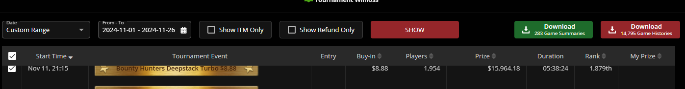

# ggsession

ggsession is a customized visualization tool for reviewing session data from GG Poker and Pokercraft exports.

## Web Deployment

This app can be deployed to GitHub Pages from your own fork with the included workflow in
[`/.github/workflows/deploy-web.yml`](./.github/workflows/deploy-web.yml).

No installation is required for end users after deployment - it runs entirely in the browser using WebAssembly.

## Demo

- [Tourney result analysis](https://blog.mcdic.net/assets/raw_html/damavaco_performance_en.html)
- [Hand history analysis](https://blog.mcdic.net/assets/raw_html/damavaco_handhistories_en.html)

## Features

The web app supports the following features:

### Tournament Summary Analysis

1. Historical Performances
2. RRE Heatmaps
3. Bankroll Analysis with Monte-Carlo Simulation
4. Your Prizes
5. RR by Rank Percentiles

### Hand History Analysis

1. All-in Equity Chart
2. Chip Histories
3. Your Hand Usage by Positions

## Data Collection

Download *"Game summaries"* file by pressing green button on your pokercraft tournament section,
and *"Hand histories"* file by pressing red button on your pokercraft tournament section.
If there are too many tournament records on your account, GGNetwork will prevent you from bulk downloading,
therefore you may have to download separately monthly or weekly records.



Also there are some expiration dates for each file;
You cannot download tournament summaries for tourneys which are 1 year old or older,
neither hand histories for tourneys which are 3 months old or older.

After you downloaded, just put all `.zip` files in single folder.
The library finds all `GG(blabla).txt` files from a selected directory and `.zip` files recursively by default.

## Development

This project uses a Rust workspace with the following crates:

- `crates/core` - Core poker analysis library
- `crates/cli` - CLI tools (benchmark, cache generation)
- `crates/wasm` - WebAssembly bindings for the web app

### Building

```bash
cargo build --release
cargo test --release
```
