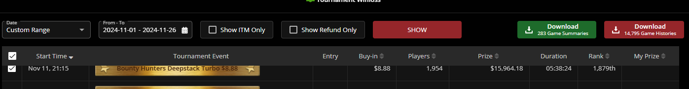

# Pokercraft Local

This is a customized visualization tool using downloaded data from Pokercraft in GGNetwork.

## Try it Online (Recommended)

**[Launch Pokercraft Local Web App](https://pokercraft.mcdic.net)**

No installation required - runs entirely in your browser using WebAssembly. Your data stays on your device and is never uploaded anywhere.

## Demo

Static exports from real Pokercraft data, generated by the web app's HTML export:

- [Tournament summary analysis](https://pokercraft.mcdic.net/demo/tournament.html)
- [Hand history analysis](https://pokercraft.mcdic.net/demo/handhistory.html)

## Features

The web app has four analysis tabs:

### Tournament Summary

1. Historical Performance
2. RRE (Relative Return of Entry) Distribution
3. Prize Distribution (individual tournaments and by weekday)
4. RR by Rank Percentile
5. Bankroll Analysis with Monte-Carlo Simulation

### Hand History

1. All-in Equity Analysis
2. Chip Histories
3. Hand Usage by Position (VPIP Heatmaps)

### Preflop Situations

1. Preflop Decision Profit by Position (Δbb vs. folding, with filters)
2. Profit by Hand Class

### Deep Dive

Analyses that join both datasets, so this tab needs tournament results *and* hand histories:

1. Final Table Runs
2. Late Registration vs. ROI

### Languages

The site, the charts, and the exported HTML are available in **English** and **Korean** (한국어).
Your language is detected from the browser and can be changed from the header.

Every string lives in a JSON file, so translating Pokercraft Local into another language
needs no TypeScript — see [the translator's guide](web/src/i18n/locales/README.md).
Contributions from native speakers are very welcome, and a partial translation is a
perfectly good pull request: anything untranslated falls back to English.

## Data Collection

Download *"Game summaries"* file by pressing green button on your pokercraft tournament section,
and *"Hand histories"* file by pressing red button on your pokercraft tournament section.
If there are too many tournament records on your account, GGNetwork will prevent you from bulk downloading,
therefore you may have to download separately monthly or weekly records.



Also there are some expiration dates for each file;
You cannot download tournament summaries for tourneys which are 1 year old or older,
neither hand histories for tourneys which are 3 months old or older.

After you downloaded, just put all `.zip` files in single folder.
The library finds all `GG(blabla).txt` files from a selected directory and `.zip` files recursively by default.

## Development

This project uses a Rust workspace with the following crates:

- `crates/core` - Core poker analysis library
- `crates/cli` - CLI tools (benchmark, cache generation)
- `crates/wasm` - WebAssembly bindings for the web app

### Building

```bash
cargo build --release
cargo test --release
```

### Web app

The web app lives in `web/` (Vite + React + TypeScript, with the Rust core compiled to WebAssembly):

```bash
./scripts/build-wasm.sh   # build the WASM package (once, and after Rust changes)
cd web
npm install
npm run dev               # local dev server
npm test                  # vitest
```
